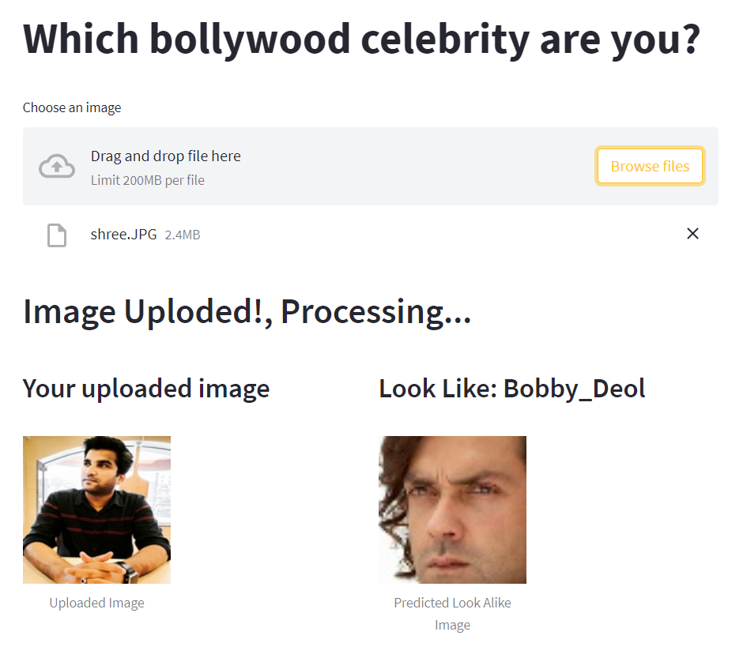

# Which Bollywood Celebrity are you
This notebook is trying to build a model which will predict Bollywood celebrity the given image looks like. This project is trained on 100 Bollywood celebrities and the dataset is taken from kaggle.  
The dataset is taken from <a href="https://www.kaggle.com/datasets/sushilyadav1998/bollywood-celeb-localized-face-dataset">Kaggle: Bollywood celeb localized face dataset</a>  
You can follow the analysis on <a href="https://www.kaggle.com/code/shrikrishnaparab/which-bollywood-celebrity-are-you-using-cnn">Kaggle</a>  

## Packeges Used:
 ![Python][python] ![scikit-learn][sklearn-image] ![Pandas][Pandas-image]  ![Jupyter Notebook][ipython-image]  
 
[python]: https://img.shields.io/badge/python-3670A0?style=for-the-badge&logo=python&logoColor=ffdd54
[sklearn-image]:https://img.shields.io/badge/scikit--learn-%23F7931E.svg?style=for-the-badge&logo=scikit-learn&logoColor=white
[Pandas-image]: https://img.shields.io/badge/pandas-%23150458.svg?style=for-the-badge&logo=pandas&logoColor=white
[ipython-image]: https://img.shields.io/badge/jupyter-%23FA0F00.svg?style=for-the-badge&logo=jupyter&logoColor=white

## Deployment:
Streamlit is used to build a front-end of the web application for Indian Cricketer Classifier and is deployed on huggingface.co.

### Check the app:

